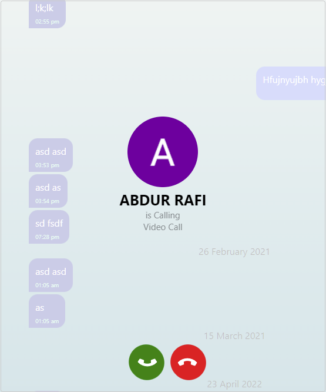

# Turtle-Chat-React
A real time chat application with react 

## Login / signup
login or signup using google or facebook

    

## Basic Chat Features

1. send messages
2. see whether other person is typing
3. see who is active 
4. which messages are seen 

    

## Calling
1. video call in local network (across different network is possible if turn server services are used)

    
     
    
     
    

## Search Users
search users by username and send message requests

    

## Create Message Groups

create message groups, update group photo and add members to groups

    

    

## Responsive Design
desktop

    

mobile

    

 

    

